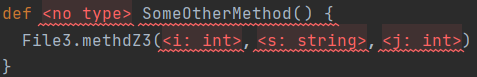

# Error Cells

Sometimes it is desired to make a cell of your editor appear like a usual error as automatically generated by MPS, e.g. when a property is empty which is not allowed to be empty.
This can be for example be the case in the editor of an abstract concept or as the empty cell of a reference or child cell.

To do this we can use a custom cell provider as described in [Custom Cells](./customCells.md#custom-cell) with a `EditorCell_Error`:

```
new AbstractCellProvider(node) {
  private node<myConcept> theNode;

  public AbstractCellProvider$anonymous(node<MyConcept> theNode)  {
    super(theNode);
    this.theNode = theNode;
  }

  @Override
  public EditorCell createEditorCell(EditorContext p1)  {
    new  EditorCell_Error(p1, this.getSNode(), "Error: " + this.theNode.someBehavior(), false);
  }
};
```

The final boolean parameter of the constructor is called `editable`.
The [javadoc] says the following:
```
@param editable - there are two different kinds of CEll_Error in MPS:
 - one (!editable) intended to show error text and then substitute it completely then user type
   something e.g. list<|<no type>>
 - another (editable) allows editing error text directly without replacing it with first types character
   e.g. myVariable.|field - in case "field" is not resolved, it should be highlighted as error, but should
   be still completely editable
```
So if `false`, the cell will completely be replaced by the first character the user types, if `true` the content may be edited.

Even though the cell is an error cell and also sets the internal error state to true,
this does not cause an error during model check.
Therefore, it is necessary to also check the appropriate condition in a checking rule.

The result can look like this (both the `<no type>` and the `<none>`):



[javadoc]: https://github.com/JetBrains/MPS/blob/7ed0ccb451197c7dc33d9395dbe0dfa74ca96786/editor/editor-runtime/source/jetbrains/mps/nodeEditor/cells/EditorCell_Error.java#L35-L42
